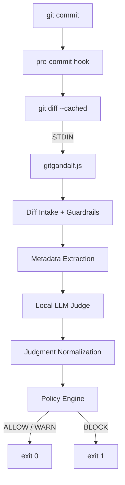

# Git Gandalf 🧙‍♂️

Git Gandalf is a **local, pre-commit code reviewer** that runs entirely on your machine and blocks risky commits before they land.

It is intentionally small, boring, and strict.

No SaaS.  
No cloud calls.  
No frameworks.  
No magic.

Just Git → Node → Local LLM → Decision.

---

## What This Is

Git Gandalf is a **Unix-style CLI tool** designed to be used from a Git `pre-commit` hook.

At commit time, it:
1. Reads the staged diff from STDIN
2. Extracts basic metadata
3. Asks a local LLM to judge the change
4. Applies a hardcoded policy
5. Allows or blocks the commit via exit code

It does **not**:
- Scan the whole repo
- Modify files
- Phone home
- Persist state
- Depend on Git internals

One run. One diff. One decision.

---

## Design Principles

- **Clear execution boundary** – one entry point, one exit code  
- **Fail closed** – ambiguous states block the commit  
- **Separation of concerns** – each stage does one thing  
- **Local-first** – everything runs on your machine  
- **Unix composability** – STDIN / STDOUT only  

---

## High-Level Flow



---

## Project Structure (P0)

```
gitgandalf/
├─ gitgandalf.js
├─ diff/
│  ├─ intake.js
│  └─ metadata.js
├─ judge/
│  ├─ prompt.v1.txt
│  └─ normalize.js
├─ policy/
│  └─ decide.js
├─ render/
│  └─ terminal.js
└─ README.md
```

---

## Using Git Gandalf Locally

### 1. Clone Git Gandalf

Clone this repository anywhere on your machine:

```bash
git clone <git-gandalf-repo-url>
cd gitgandalf
```

Install dependencies (if any):

```bash
npm install
```

---

### 2. Run a Local LLM

Git Gandalf expects a **local, OpenAI-compatible LLM server**.

Example using LM Studio:

1. Open LM Studio
2. Download a model (e.g. Qwen, Llama)
3. Start the local server
4. Ensure the API is available at:

```
http://127.0.0.1:1234
```

Git Gandalf does not manage models.  
It only sends prompts to a running local server.

---

### 3. Wire Git Gandalf to a Repo

In the repository you want to protect, create a Git pre-commit hook:

```
.git/hooks/pre-commit
```

Add:

```sh
#!/bin/sh

DIFF=$(git diff --cached)

if [ -z "$DIFF" ]; then
  exit 0
fi

echo "$DIFF" | node /absolute/path/to/gitgandalf.js
exit $?
```

Make it executable:

```bash
chmod +x .git/hooks/pre-commit
```

---

### 4. Usage

From now on:

- Normal commits run Git Gandalf automatically
- High-risk changes can block commits
- You can bypass at any time with:

```bash
git commit --no-verify
```

Git Gandalf never modifies your code or your repository.


## Scope (P0)

- One hardcoded policy
- No config
- No telemetry
- No background processes

This is deliberate.

---

Git Gandalf is a guardrail, not a replacement for code review.
